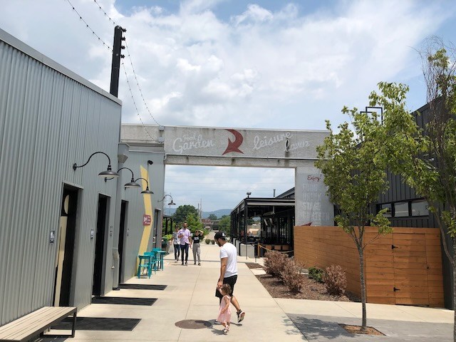

As you hopefully noticed on our [wedding web site](https://maryandlyle.com/), we’re having a sort of mixer Friday night (June 30) at [Stovehouse](https://www.stovehouse.com/) for our guests to hang out and meet before the event on Saturday. We wanted to share some information about that before then.

## When is it?

We have rented the “Canteen” room at Stovehouse, from 6 p.m. - 8 p.m. (CDT) on Friday evening.

## Where should I park?

There are two parking lots adjoining Stovehouse. One of them is due west of Stovehouse, off of Governors Dr., and it’s definitely the easier place to park, in my experience. Your GPS will likely lead you to the *other* parking lot, which is due east of Stovehouse — parking is usually limited there, but you might get lucky.

## Find Us When You Get There

Here’s a map of the Stovehouse complex:

[https://www.stovehouse.com/stovehouse-map/](https://www.stovehouse.com/stovehouse-map/)

### I parked where you told me to

If you park in the parking lot that’s west of Stovehouse, you should come in the entrance labelled “Main West” on the map. Here’s what that entrance looks like:

Walk straight ahead through the courtyard...

you should see a sign overhead welcoming you to the food garden:

... and then turn left into the food garden area:

Now walk straight ahead, past some restaurants on your left, to the door labelled "Canteen & Booth Bar":

Go in there and the Canteen room will be to your left!

# I parked in that other parking lot

If you parked in that parking lot that’s east of Stovehouse, you should come in the entrance labelled “Gas Light East” on the [Stovehouse map](https://www.stovehouse.com/stovehouse-map/). Here’s what that will look like:

Walk straight ahead down Gas Light Alley and look for a door on your left labelled “The Canteen”:

## Food

Here’s a link to the directory of restaurants and other shops at Stovehouse:

[https://www.stovehouse.com/directory/](https://www.stovehouse.com/directory/)

We expect there to be a large crowd at Stovehouse on Friday night — it’s a popular place. So you might want to place your food order before you leave your hotel, so that it can be ready when you arrive on site.